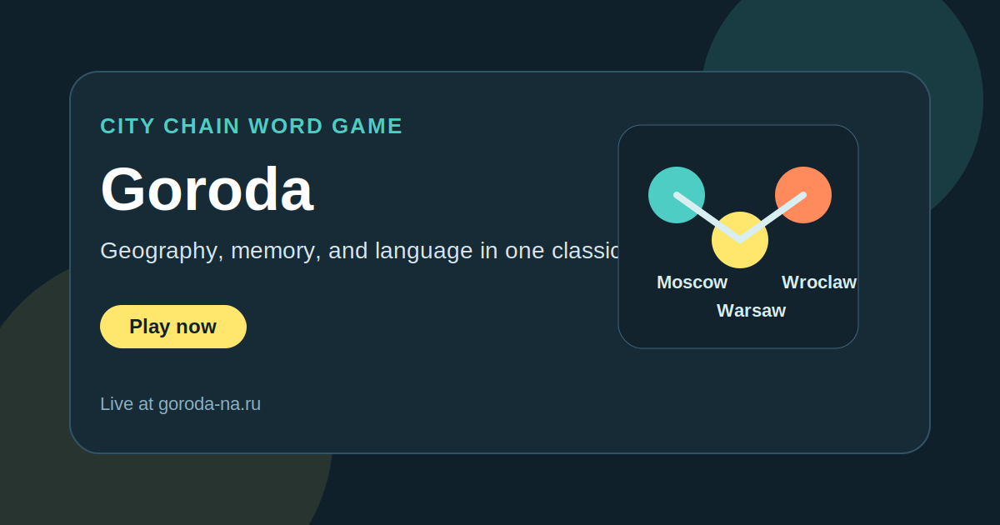

<h1 align="center">Goroda</h1>

  A browser version of the classic cities word game, built for fast Russian-language play and supported by a reusable city dataset.

  <a href="https://goroda-na.ru/"><strong>Play Now</strong></a>
  ·
  <a href="https://github.com/ivanlukichev/Goroda-na"><strong>GitHub Repo</strong></a>
  ·
  <a href="https://github.com/ivanlukichev/Goroda-na/blob/main/city-list-games"><strong>Open Data</strong></a>

  

## What It Is

Goroda takes the familiar spoken game of naming cities by the last letter and turns it into a clean browser experience. It keeps the mechanic recognizable, lowers friction, and makes the format easier to explore online for both play and search discovery.

This public repository is a lightweight product landing page with an extra practical layer: the city list used for validation and content generation is also exposed as a reusable resource.

## Why It Feels Different

- It modernizes a well-known offline word game without overcomplicating it.
- The theme mixes language, memory, and geography in a simple loop.
- The public repo is useful even beyond the site because it includes shareable data.
- It is designed for quick sessions instead of long onboarding.

## Open Data

The repository includes a curated city list used for gameplay, validation, and city-based pages:

- Data file: [city-list-games](https://github.com/ivanlukichev/Goroda-na/blob/main/city-list-games)
- Scope: 5,336 city names
- Uses: word games, lookup tools, geography experiments, validation logic

## Project Snapshot

- Genre: word and geography game
- Language: Russian
- Stack: static front end
- Core mechanic: name a city starting with the last valid letter
- Extra asset: reusable open city list

## More Projects

| Project | Live site | Public repo |
| --- | --- | --- |
| Slova Game | [slova-game.ru](https://slova-game.ru/) | [SlovaGame](https://github.com/ivanlukichev/SlovaGame) |
| Word Chain Game | [word-chain-game.com](https://word-chain-game.com/) | [Word-Chain-Game](https://github.com/ivanlukichev/Word-Chain-Game) |
| PlayBlockGame | [playblockgame.ru](https://playblockgame.ru/) | [PlayBlockGame](https://github.com/ivanlukichev/PlayBlockGame) |
| Tic-Tac-Toe | [крестики-нолики.рф](https://крестики-нолики.рф/) | [---](https://github.com/ivanlukichev/---) |
| Solitaire | [играть-пасьянс.рф](https://играть-пасьянс.рф/) | [-](https://github.com/ivanlukichev/-) |
| Sudoku Play | [sudoku-play.org](https://sudoku-play.org/) | [Sudoku-Play](https://github.com/ivanlukichev/Sudoku-Play) |
| CalcSprint | [calcsprint.com](https://calcsprint.com/) | [CalcSprint](https://github.com/ivanlukichev/CalcSprint) |
| Number Hunt | [numberhuntgame.com](https://numberhuntgame.com/) | [numberhuntgame](https://github.com/ivanlukichev/numberhuntgame) |

## Visit

  <a href="https://goroda-na.ru/"><strong>Open Goroda</strong></a> 
  Classic city-chain gameplay with a reusable city dataset behind it.

